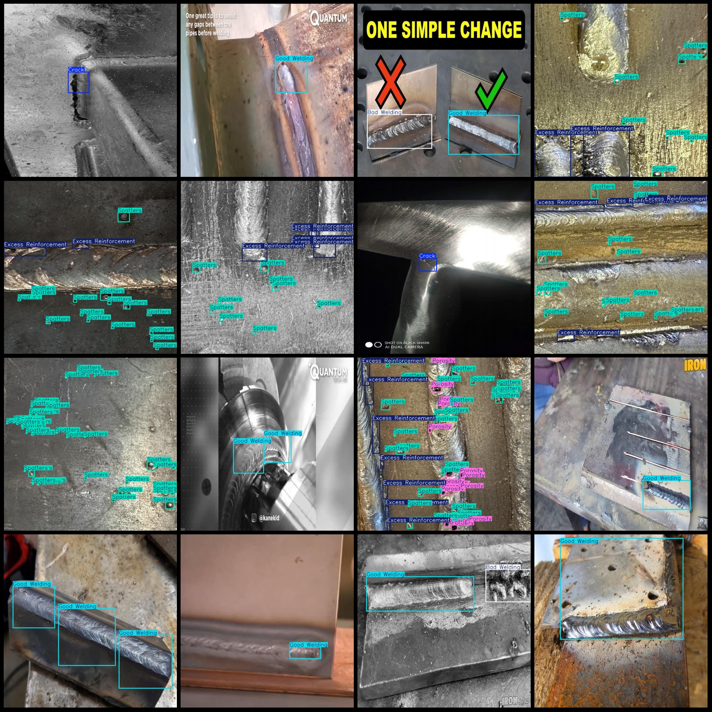
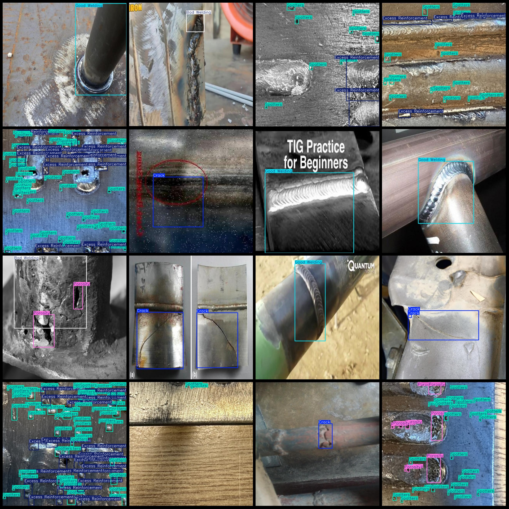

# Welding Defect Detection Dataset in Pascal VOC + YOLO Format
1494 Images, 6 Classes

Note: Some images are enhanced.
Dataset format: Pascal VOC format + YOLO format (txt file without segmentation path, only containing jpg images and corresponding VOC format xml files and yolo format txt files)
Number of images (jpg file count): 1494
Number of annotations (xml file count): 1494
Number of annotations (txt file count): 1494
Number of classes: 6
Annotation categories: ["Bad Welding", "Crack", "Excess Reinforcement", "Good Welding", "Porosity", "Spatters"]
Box counts for each category:
- Bad Welding (Poor Welding) box count = 236
- Crack (Crack) box count = 512
- Excess Reinforcement (Over-reinforcement) box count = 2660
- Good Welding (Good Welding) box count = 399
- Porosity (Porosity) box count = 5056
- Spatters (Spatters) box count = 15851
Total box counts: 24714
Image resolution: 640x640
Annotation tool used: labelImg
Annotation rules: draw boxes around the categories
Important note: The dataset does not have a division into training, validation, or test sets; it needs to be divided by oneself.
Special declaration: This dataset does not guarantee any accuracy of the trained models or weight files.
Image preview:

## Images

Here is a pay link on Stripe ( https://buy.stripe.com/3cs8yP7sY87d0vu9AB ). Please contact me lonlonago@foxmail.com after funding $89, and I will send you a complete data files , thank you!

